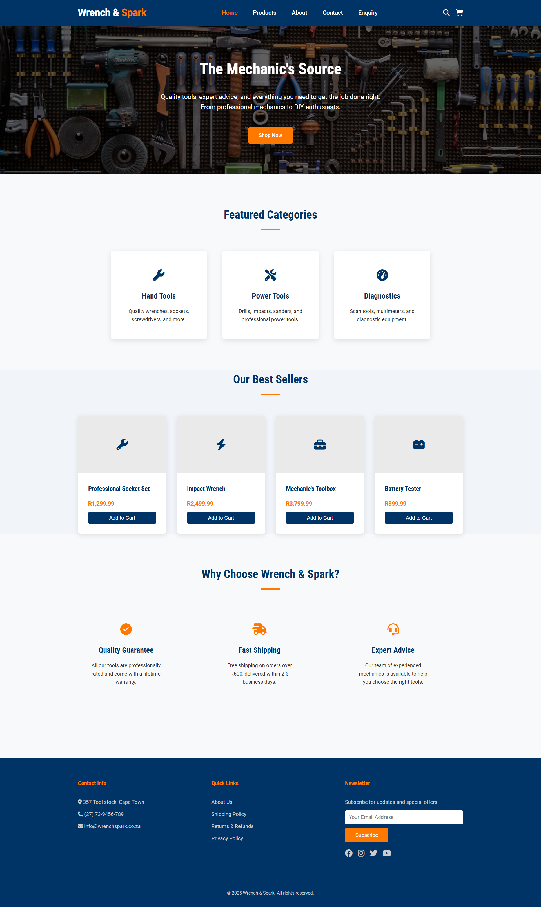
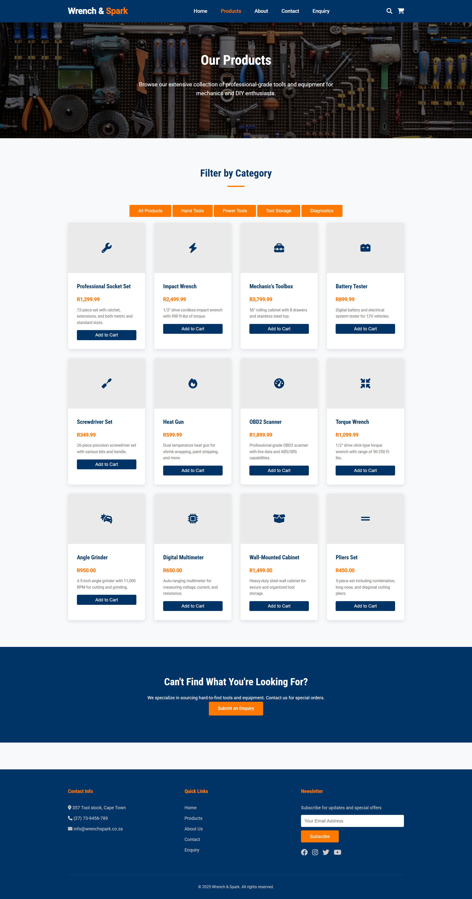
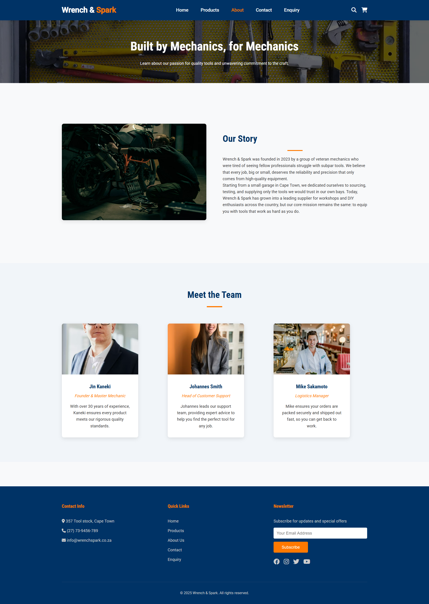
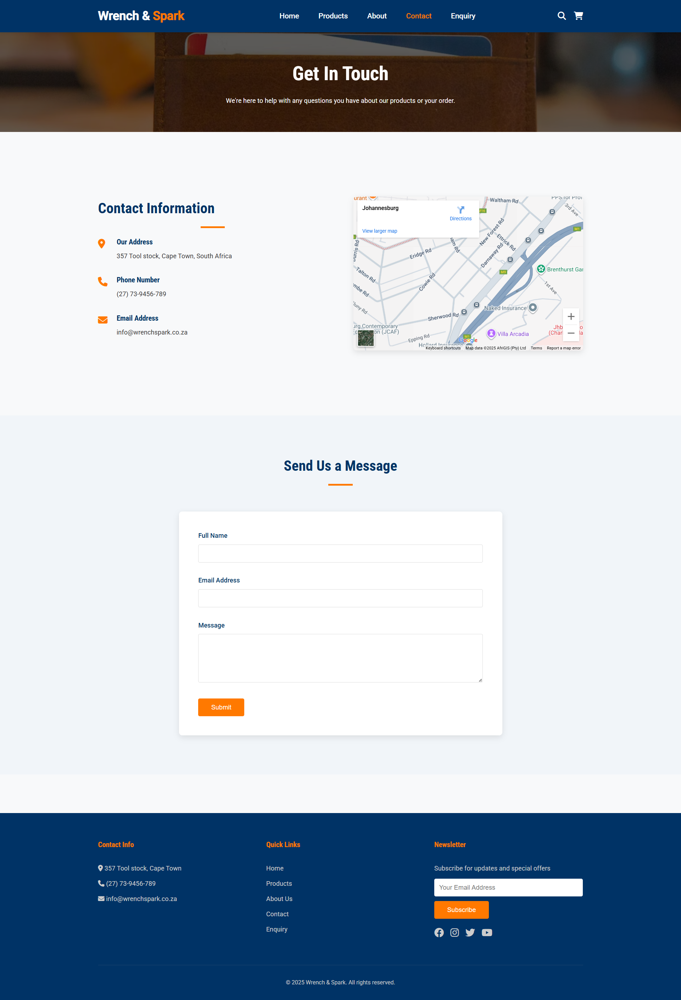
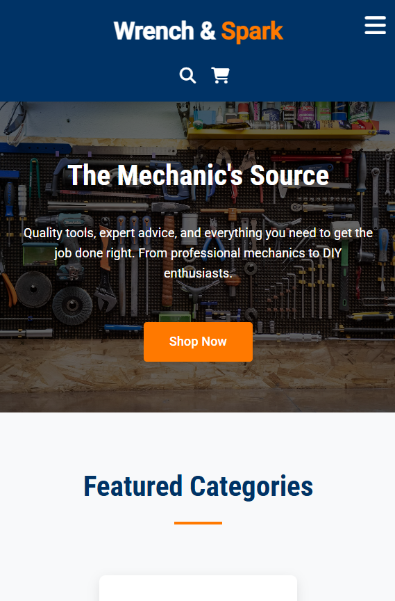
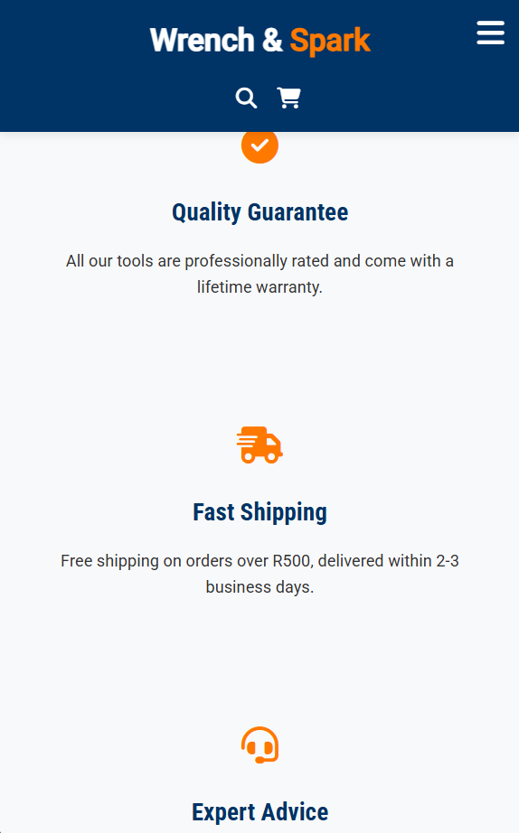

# Wrench-and-Spark-Website
# Wrench & Spark: Online Tool Emporium
Wrench & Spark is a user-friendly, responsive e-commerce website designed for a specialized online tool retailer. The project was born from a frustration with the lack of reliable, high-quality online stores for professional and hobbyist mechanics. This platform aims to provide customers with durability and performance at a fair price by sourcing tools directly from trusted manufacturers.
## Mission and Vision
* Mission Statement: To empower every mechanic, from the professional in the pit garage to the DIY enthusiast in their home garage, with the highest quality tools, expert advice, and unparalleled customer service.
* Vision Statement: To become the most trusted and go-to online destination for automotive tools and equipment in the region.
## Key Features
* Responsive Design: A mobile-first approach ensures a seamless experience on all devices, from desktops to smartphones.
* Product Showcase: A clean and organized product grid to display tools with images, descriptions, and pricing.
* Category Filtering: Users can easily filter products by categories such as "Hand Tools," "Power Tools," and "Diagnostics."
* Static Pages: Includes essential pages like Home, About Us, Products, and Contact.
* Interactive UI: Smooth transitions and hover effects create an engaging user experience.
* Newsletter Subscription: A footer section for users to subscribe to updates and special offers.
## Target Audience
This website is designed for:
* Professional mechanics and automotive technicians.
* Serious DIY car enthusiasts and hobbyists.
* Automotive repair shops looking to equip their teams.
* Vocational and technical schools for their training programs.
## Design and User Experience
The design choices were made to create a professional, trustworthy, and clean aesthetic that reflects the quality of the products.
* Color Palette:
   * #003366 (Prussian Blue): Evokes trust, professionalism, and reliability. Used for the header, footer, and primary buttons.
   * #FF7900 (Safety Orange): A vibrant accent color that signifies energy and action. Used for logos, highlights, and call-to-action buttons.
   * #f8f9fa (Light Gray): A clean and neutral background color that improves readability.
* Typography:
   * Roboto Condensed: Used for headings to provide a strong, modern, and technical feel.
   * Roboto: Used for body text for its high readability and clean appearance.
## Technologies Used
This project is built entirely with front-end technologies, focusing on a clean and maintainable codebase.
* HTML5: For the structure and content of the website.
* CSS3: For styling, layout (Flexbox), and responsive design.
* JavaScript (ES6): For interactive elements like the mobile menu toggle and product filtering.

# Changelog - Wrench & Spark Website

All notable changes to this project will be documented in this part.

## [Part 2] - 2025-09-25

### Added
- Complete CSS styling for all website pages
- Responsive design implementation using media queries
- CSS Grid and Flexbox layout systems
- Interactive elements with hover and focus states
- Mobile-first responsive design approach
- CSS custom properties (variables) for consistent theming
- Typography scale using relative units (rem/em)
- Product filtering functionality on products page
- Form validation for contact and enquiry forms
- Accessibility improvements (focus states, ARIA labels)

### Changed
- Refactored CSS to use relative units instead of fixed pixels
- Improved responsive breakpoints for better mobile experience
- Enhanced color scheme consistency using CSS variables
- Optimized image loading with responsive image techniques
- Updated navigation to be fully responsive with mobile menu
- Improved form styling and user experience

### Fixed
- Cross-browser compatibility issues
- Mobile navigation toggle functionality
- Form validation error handling
- Layout issues on small screens
- Color contrast ratios for accessibility

## [Part 1] - 2025-08-27

### Added
- Initial project structure and file organization
- HTML5 semantic structure for all pages
- Basic content architecture and sitemap
- Project proposal documentation
- GitHub repository setup

### Changed
- Improved HTML semantic structure based on feedback
- Enhanced documentation clarity

### Fixed
- Broken links in navigation
- HTML validation errors

## Screenshots.
Home page

Products page

About page

Contact page

On Mobile

on Mobile

## References
In the Proposal document
1.	Colour Psychology in Marketing. (2022). The Meaning of Colour. https://www.helpscout.com/blog/psychology-of-color/
2.	Google Fonts. (n.d.). Roboto & Roboto Condensed. https://fonts.google.com/
3.	Moz. (2023). Beginner's Guide to SEO. https://moz.com/beginners-guide-to-seo
4.	Stripe. (n.d.). Payment Processing. https://stripe.com/en-za (For future e-commerce functionality research).

### Part 1: HTML Structure & Planning  

- MDN Web Docs. 2023. *HTML5 Semantic Elements*. [online]. Mozilla Foundation. Available at: https://developer.mozilla.org/en-US/docs/Web/HTML/Element [Accessed 23 August 2025].

- W3C. 2023. *HTML Living Standard*. [online]. Web Hypertext Application Technology Working Group. Available at: https://html.spec.whatwg.org/ [Accessed 23 August 2025].

- W3Schools. 2023. *HTML Tutorial*. [online]. Available at: https://www.w3schools.com/html/ [Accessed 23 August 2025].  

---

### Part 2: CSS Implementation & Responsive Design  

- MDN Web Docs. 2023. *CSS Grid Layout*. [online]. Mozilla Foundation. Available at: https://developer.mozilla.org/en-US/docs/Web/CSS/CSS_Grid_Layout [Accessed 22 September 2025].  

- MDN Web Docs. 2023. *Flexbox*. [online]. Mozilla Foundation. Available at: https://developer.mozilla.org/en-US/docs/Web/CSS/CSS_Flexible_Box_Layout [Accessed 21 September 2025].  

- Google Fonts. 2023. *Roboto & Roboto Condensed*. [online]. Google LLC. Available at: https://fonts.google.com/specimen/Roboto [Accessed 23 September 2025].  

- Font Awesome. 2023. *Icon Library*. [online]. Fonticons, Inc. Available at: https://fontawesome.com/ [Accessed 22 September 2025].  

- Unsplash. 2023. *Stock Photography*. [online]. Available at: https://unsplash.com/s/photos/mechanics-tools and Business men available at : https://unsplash.com/s/photos/corporate-man[Accessed 25 August 2025].

   

- W3C. 2023. *CSS Custom Properties for Cascading Variables*. [online]. World Wide Web Consortium. Available at: https://www.w3.org/TR/css-variables-1/ [Accessed 23 September 2025].  

- Smashing Magazine. 2022. *Responsive Web Design*. [online]. Available at: https://www.smashingmagazine.com/2025/02/taking-rwd-to-the-extreme/ [Accessed 17 September 2025].  

- CSS-Tricks. 2023. *A Complete Guide to Flexbox*. [online]. Available at: https://css-tricks.com/snippets/css/a-guide-to-flexbox/ [Accessed 23 September 2025].  

- CSS-Tricks. 2023. *A Complete Guide to Grid*. [online]. Available at: https://css-tricks.com/snippets/css/complete-guide-grid/ [Accessed 24 September 2025].  

---

#### Tools.
1.	Professional Socket Set:
○	Example Product: GearWrench 84-Piece Master Socket Set
○	Reference Link: https://www.protoindustrial.com/products/hand-tools/ratchets-sockets 
2.	Cordless Impact Wrench:
○	Example Product: Milwaukee M18 FUEL 1/2" High Torque Impact Wrench
○	Reference Link: https://www.milwaukeetool.com/Products/Power-Tools/Fastening/Impact-Wrenches/2767-20
3.	OBD2 Scanner:
○	Example Product: Autel MaxiCOM MK808BT Pro Diagnostic Scanner
○	Reference Link: https://autel.com/mk2/3228.jhtml 
4.	Digital Multimeter:
○	Example Product: Fluke 115 Compact True-RMS Digital Multimeter
○	Reference Link: https://www.fluke.com/en-us/product/electrical-testing/digital-multimeters/fluke-115

---

## Run
* How to Run This Project Locally
To view and run this project on your local machine, follow these simple steps:
   1. Clone the repository:
git clone https://github.com/Jeankaneki/Wrench-and-Spark-Website.git

   2. Navigate to the project directory:
cd wrench-and-spark-website

   3. Open index.html in your browser:
      * Simply double-click the index.html file, or right-click and choose "Open with" your preferred web browser.
No special installations or dependencies are required.
